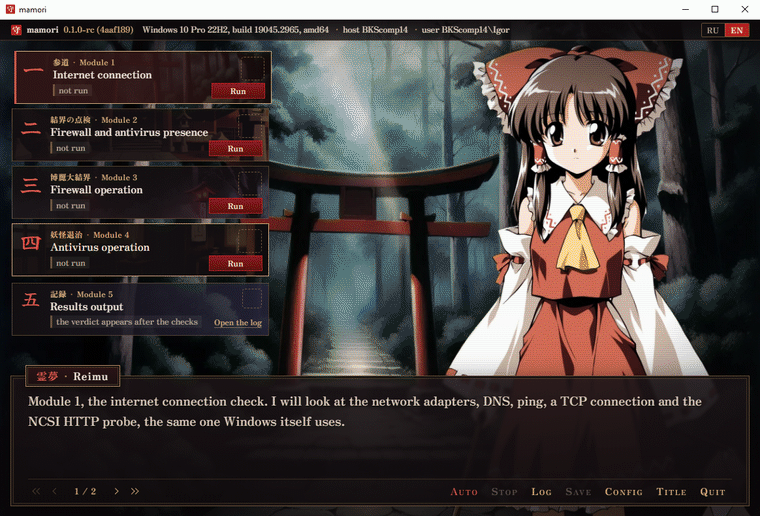
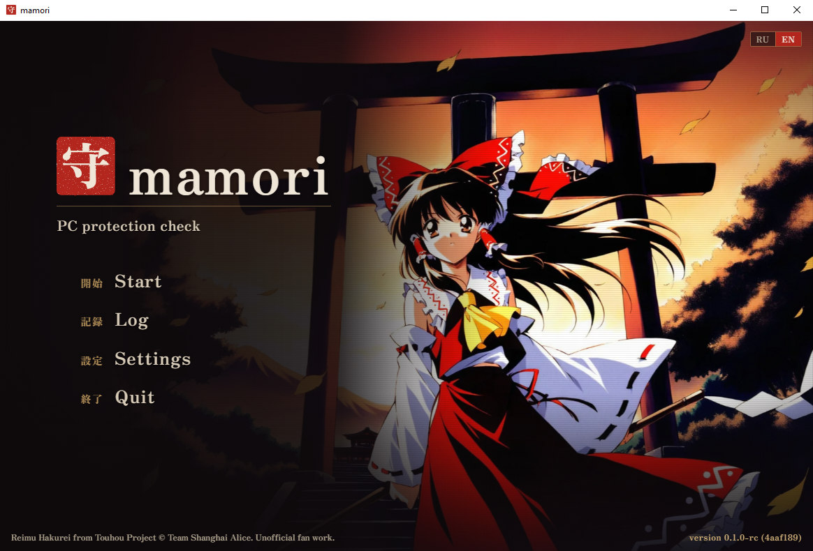
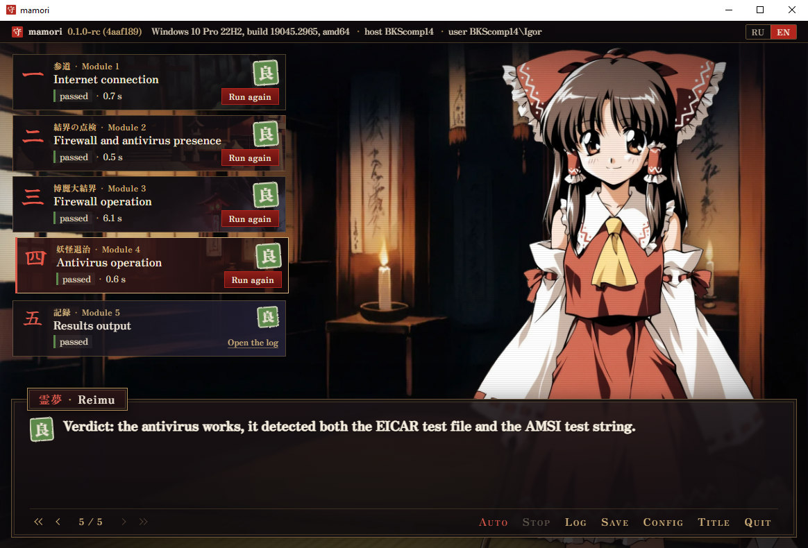
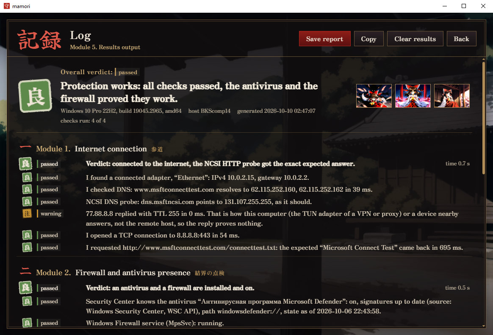
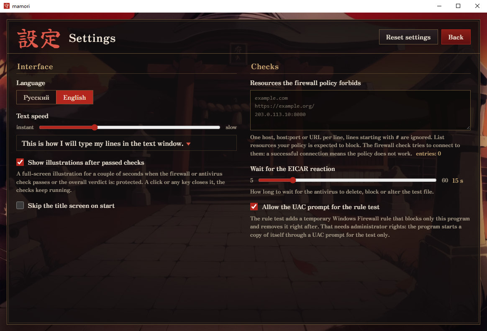

<p align="center">
  
</p>

<h1 align="center">mamori</h1>

<p align="center">
  Checks that the antivirus and the firewall on a Windows PC react to a test, not only that they
  are installed.
  <br>
  English | <a href="README.ru.md">Русский</a>
</p>

<p align="center">
  
</p>

The Windows Security app shows what a protection product reports about itself. A resident monitor
can be switched off, the firewall profile of the current network disabled, local rules overridden
by group policy, and the green tick stays. mamori asks the products what they report, then checks
how they behave: it writes the EICAR test file and passes the AMSI test string to the antivirus,
and it adds a temporary firewall rule against its own connection and checks that the connection is
refused.

Every verdict comes with the findings behind it: addresses, timings, Windows error codes. A check
that could not be done is reported as such, never as a pass or a failure. The window is an early
2000s visual novel in which Reimu Hakurei reads the findings out line by line; the reports stay
plain technical text.

<p align="center">
  
</p>

## What it checks

The five modules follow the coursework guide. Each of the first four runs on its own, can be
stopped and repeated, and streams its findings as they come.

| Module | How | Verdicts |
|---|---|---|
| 1. Internet connection | network adapters, DNS, ICMP through `IcmpSendEcho2`, TCP, the NCSI HTTP and DNS probes that Windows itself uses | online; captive portal; no DNS; limited; offline |
| 2. Firewall and antivirus presence | Windows Security Center API with a WMI fallback, `INetFwPolicy2`, Defender status through WMI, traces of 19 known products on disk, among processes and services | both present and on; present but out of date or snoozed; no antivirus; no firewall; neither; unknown |
| 3. Firewall operation | connections to resources the policy must block, then a temporary outbound block rule for mamori itself with a control connection before and after | works; does not apply rules; off; not confirmed |
| 4. Antivirus operation | the EICAR file written to a temporary folder, the AMSI test string through `AmsiScanString` | works; partly; does not work; could not check |
| 5. Results output | the worst status of the checks that ran, the log screen, TXT, HTML and JSON reports | protected; partly checked; not fully confirmed; unprotected; error; nothing run |

The rule test needs administrator rights. mamori itself starts without them: for this one test it
launches a copy of itself through a UAC prompt, and the copy removes its rule in a deferred call,
also when the check is cancelled. The prompt can be turned off in the settings.

## Results in test machines

Every scenario was run from the window with Auto in Windows 10 22H2 virtual machines, the CI row
comes from the end-to-end job on a GitHub runner.

| Scenario | 1 Internet | 2 Presence | 3 Firewall | 4 Antivirus | Overall |
|---|---|---|---|---|---|
| Defender and Windows Firewall on | pass | pass | pass | pass | protected |
| Windows Firewall off on all profiles | pass | fail | fail | pass | unprotected |
| Defender real-time protection off | pass | warning | pass | fail | unprotected |
| Network cable unplugged | fail | pass | warning | pass | not fully confirmed |
| A rule blocks 1.0.0.1, listed as forbidden | pass | pass | pass, policy confirmed | pass | protected |
| COMODO Internet Security 12.4 | pass | pass | pass | warning | not fully confirmed |
| GitHub runner, Windows Server | pass | fail | pass | fail | unprotected |

COMODO blocks the EICAR file, but registers no AMSI provider, so the AMSI half of module 4 cannot
run and the verdict is "partly". The runner has no Security Center and Defender real-time
protection is off there, which is what modules 2 and 4 report.

<table>
  <tr>
    <td></td>
    <td></td>
  </tr>
  <tr>
    <td></td>
    <td></td>
  </tr>
</table>

## The look

Reimu's face follows the state of the selected check, and every status also has a seal and a
word, so colour is never the only signal. A passed firewall check, a passed antivirus check and a
protected machine each open an event illustration, which a click or any key closes.

<p align="center">
  
  
</p>

The keyboard reaches everything, results go to screen readers through an aria-live region, and
with reduced motion turned on in Windows the text appears at once and nothing animates. The
installer carries the same art on its welcome and finish pages.

## Install

Download `mamori-amd64-installer.exe` (or `arm64`) from
[Releases](https://github.com/blsssss/mamori/releases). The installer puts mamori into
`Program Files\mamori`, adds shortcuts and an uninstaller, and installs the WebView2 Runtime if
Windows lacks it. The bare executables in the same release run without installing.

The files are not code-signed, so SmartScreen warns about an unknown publisher. Check them
before running:

```powershell
Get-FileHash .\mamori-amd64-installer.exe -Algorithm SHA256   # compare with SHA256SUMS.txt
gh attestation verify .\mamori-amd64-installer.exe --repo blsssss/mamori
```

The attestation proves that the file was built by the release workflow of this repository from
the tagged commit.

Some antiviruses show a threat notification during module 4. That is the EICAR test file doing its
job; mamori deletes it after the check.

## Without a window

`--probe` runs checks without the interface and writes JSON. mamori is a GUI program, so the shell
has to wait for it:

```powershell
Start-Process .\mamori.exe -ArgumentList '--probe','all','-out','result.json' -Wait
Get-Content result.json | ConvertFrom-Json | Select-Object -ExpandProperty results
```

`--probe` takes `internet`, `inventory`, `firewall`, `antivirus`, `all` or `firewall-rule` (the rule
test alone, needs an elevated shell). `-policy host1,https://host2/` lists resources the firewall
policy must block, `-eicar-wait 30s` changes how long module 4 waits for the antivirus.
[scripts/e2e.ps1](scripts/e2e.ps1) is the end-to-end test CI runs this way.

## Building

Go 1.27, Node.js 24, the Wails CLI v2.16 and, for the installer, NSIS 3.

```
go install github.com/wailsapp/wails/v2/cmd/wails@v2.16.0
make check        # gofmt, go vet, unit tests, Biome, svelte-check, Vitest
make build        # build/bin/mamori.exe
make installer    # adds build/bin/mamori-amd64-installer.exe
make dev          # hot reload against the real checks
```

`cd frontend && npm run dev` opens the interface in a browser with a demo backend
(`?scenario=protected`, `no-firewall`, `no-antivirus`, `offline`, `no-admin`), handy for working on the look without
Windows.

## Safety

- No telemetry, no external resources: the interface, fonts and art are embedded in the
  executable. Network traffic is limited to the NCSI hosts, three control hosts and the resources
  you list.
- The EICAR and AMSI test strings are not stored in the binary in plain form, they are assembled in
  memory right before use.
- The temporary rule applies only to `mamori.exe` and one address. A rule left by a crashed copy
  is removed at the start of the next rule test.
- The manifest asks for `asInvoker`; the only elevation is the UAC prompt of the rule test.

What mamori cannot see and where its verdicts rest on assumptions is listed in
[LIMITATIONS](docs/en/LIMITATIONS.md).

## Documentation

- [docs/en/ARCHITECTURE.md](docs/en/ARCHITECTURE.md) - packages, the Go and interface boundary,
  the elevated copy.
- [docs/en/CHECKS.md](docs/en/CHECKS.md) - every check step by step, with finding codes.
- [docs/en/LIMITATIONS.md](docs/en/LIMITATIONS.md) - what the results do and do not prove.

## Background

mamori is a coursework project for the course "Methods for assessing the security of computer
systems" at MTUCI (Moscow Technical University of Communications and Informatics), autumn 2026.
The guide asked for five modules and a window; the visual novel is my own addition.

## License

The code is MIT, see [LICENSE](LICENSE).

The art is not covered by the MIT license. Reimu Hakurei and Touhou Project belong to Team
Shanghai Alice; mamori is an unofficial fan work. The backgrounds, the sprite and the event
illustrations were generated locally with Animagine XL 4.0 (CreativeML Open RAIL++-M). The fonts
Zen Antique and Yuji Syuku are under the SIL Open Font License, their license texts are in
[frontend/src/assets/fonts](frontend/src/assets/fonts).
