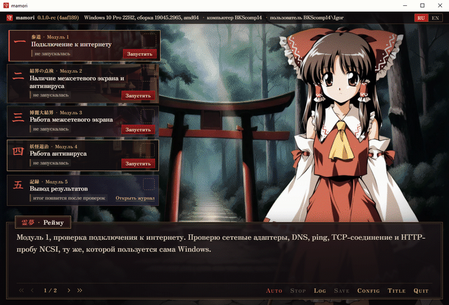
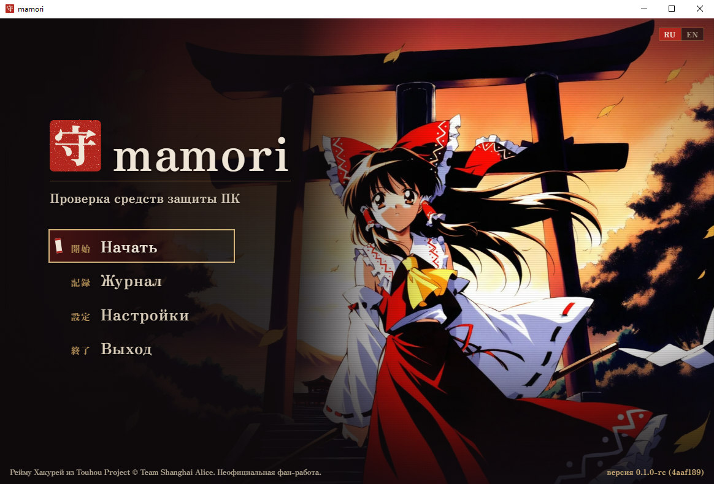
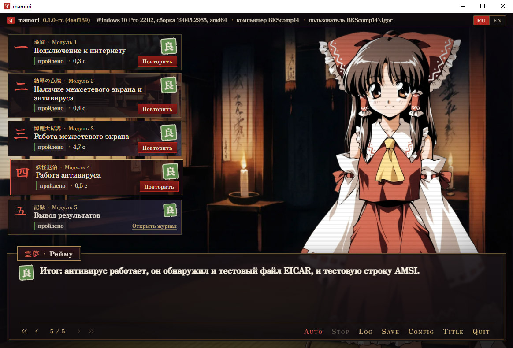
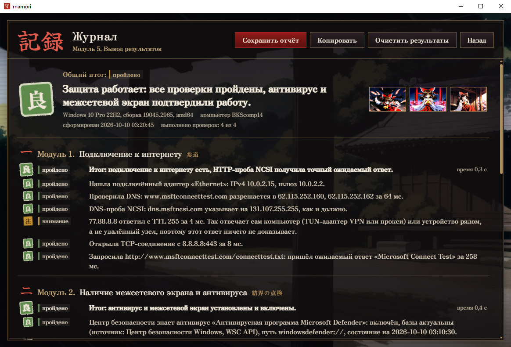
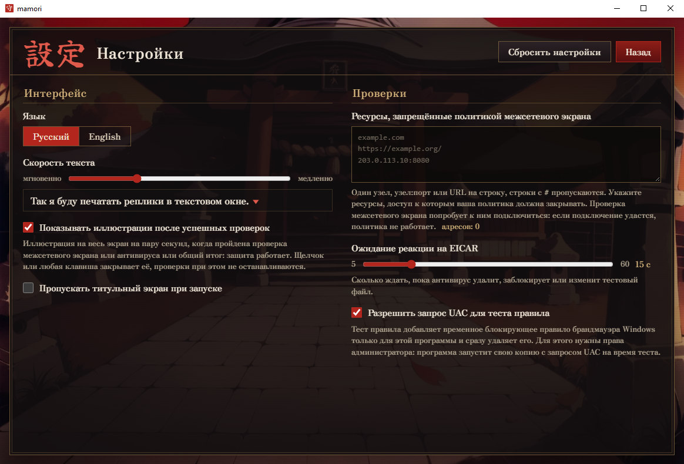
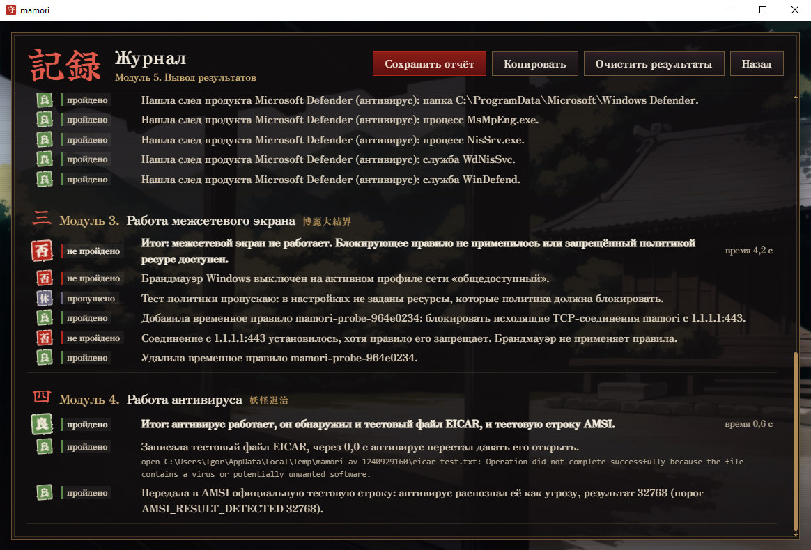
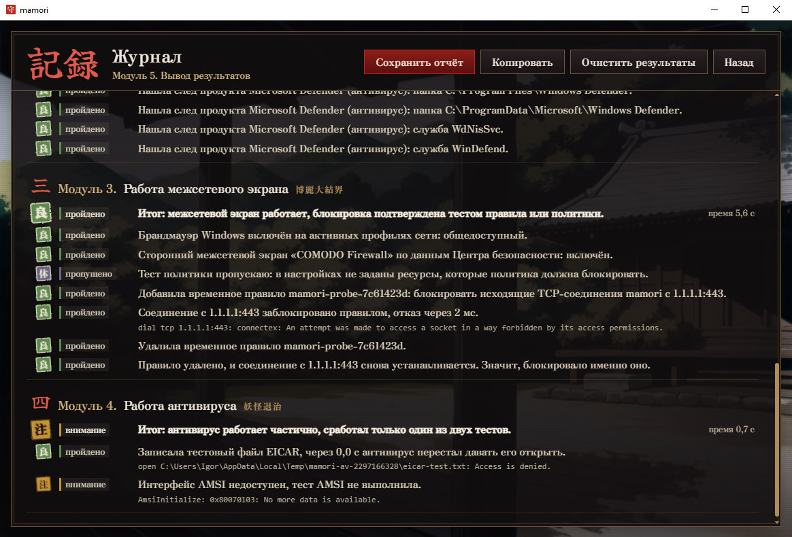

<p align="center">
  
</p>

<h1 align="center">mamori</h1>

<p align="center">
  Проверяет, что антивирус и межсетевой экран на компьютере с Windows реагируют на тест, а не
  только установлены.
  <br>
  <a href="README.md">English</a> | Русский
</p>

<p align="center">
  
</p>

Приложение «Безопасность Windows» показывает то, что средство защиты сообщило о себе само.
Резидентный монитор при этом может быть выключен, профиль брандмауэра для текущей сети отключён,
локальные правила подавлены групповой политикой, а зелёная галочка останется на месте. mamori
сначала спрашивает продукты, что они о себе сообщают, а затем проверяет, как они себя ведут:
записывает тестовый файл EICAR и передаёт антивирусу тестовую строку AMSI, добавляет временное
правило брандмауэра против собственного соединения и проверяет, что соединение не проходит.

К каждому вердикту приложены находки, на которых он основан: адреса, время, коды ошибок Windows.
Проверка, которую выполнить не удалось, так и называется, а не выдаётся ни за успех, ни за отказ.
Окно оформлено как визуальная новелла начала 2000-х: находки по строчке зачитывает Рейму Хакурей,
а отчёты остаются сухим техническим текстом.

<p align="center">
  
</p>

## Что проверяется

Пять модулей повторяют методические указания к курсовой работе. Каждую из первых четырёх проверок
можно запустить отдельно, остановить и повторить, а находки появляются по мере поступления.

| Модуль | Как | Вердикты |
|---|---|---|
| 1. Подключение к интернету | сетевые адаптеры, DNS, ICMP через `IcmpSendEcho2`, TCP, HTTP- и DNS-пробы NCSI, которыми пользуется сама Windows | подключение есть; перехватывающий портал; DNS не работает; доступ ограничен; подключения нет |
| 2. Наличие МЭ и антивируса | API Центра безопасности Windows с запасным путём через WMI, `INetFwPolicy2`, состояние Defender через WMI, следы 19 известных продуктов на диске, среди процессов и служб | оба есть и включены; есть, но базы устарели или защита приостановлена; нет антивируса; нет МЭ; нет ни того, ни другого; установить не удалось |
| 3. Работа межсетевого экрана | подключение к ресурсам, которые политика должна запрещать, затем временное правило, блокирующее исходящие соединения самой mamori, с контрольным соединением до и после | работает; не применяет правила; выключен; не подтверждена |
| 4. Работа антивируса | файл EICAR во временном каталоге, тестовая строка AMSI через `AmsiScanString` | работает; работает частично; не работает; проверить не удалось |
| 5. Вывод результатов | худший статус выполненных проверок, экран журнала, отчёты TXT, HTML и JSON | защищён; проверено частично; подтверждено не полностью; не защищён; ошибка; проверки не выполнялись |

Проверке правилом нужны права администратора. Сама mamori запускается без них: только для этой
проверки она запускает свою копию через запрос UAC, а копия удаляет правило отложенным вызовом, в
том числе при отмене. Запрос UAC можно запретить в настройках.

## Результаты на тестовых машинах

Каждый сценарий запускался из окна кнопкой Auto в виртуальных машинах с Windows 10 22H2, строка
CI взята из сквозного теста на раннере GitHub.

| Сценарий | 1 Интернет | 2 Наличие | 3 МЭ | 4 Антивирус | Итог |
|---|---|---|---|---|---|
| Defender и брандмауэр Windows включены | пройдено | пройдено | пройдено | пройдено | защищён |
| Брандмауэр Windows выключен на всех профилях | пройдено | не пройдено | не пройдено | пройдено | не защищён |
| Защита Defender в реальном времени выключена | пройдено | внимание | пройдено | не пройдено | не защищён |
| Сетевой кабель отключён | не пройдено | пройдено | внимание | пройдено | подтверждено не полностью |
| Правило запрещает 1.0.0.1, адрес указан как запрещённый | пройдено | пройдено | пройдено, политика подтверждена | пройдено | защищён |
| COMODO Internet Security 12.4 | пройдено | пройдено | пройдено | внимание | подтверждено не полностью |
| Раннер GitHub, Windows Server | пройдено | не пройдено | пройдено | не пройдено | не защищён |

COMODO блокирует файл EICAR, но не регистрирует провайдер AMSI, поэтому вторая половина модуля 4
выполниться не может и вердикт получается «частично». На раннере нет Центра безопасности и
выключена защита Defender в реальном времени, о чём и сообщают модули 2 и 4.

<table>
  <tr>
    <td></td>
    <td></td>
  </tr>
  <tr>
    <td></td>
    <td></td>
  </tr>
  <tr>
    <td></td>
    <td></td>
  </tr>
</table>

## Оформление

Выражение лица Рейму зависит от состояния выбранной проверки, а у каждого статуса есть ещё печать
и слово, так что цвет никогда не единственный признак. Пройденная проверка МЭ, пройденная проверка
антивируса и защищённый компьютер открывают иллюстрацию события, которую закрывает щелчок или
любая клавиша.

<p align="center">
  
  
</p>

Всем можно управлять с клавиатуры, итоги проверок передаются программе экранного доступа через
область aria-live, а если в Windows включено уменьшение движения, текст появляется сразу и ничего
не анимируется. На страницах приветствия и завершения установщика та же графика.

## Установка

Скачайте `mamori-amd64-installer.exe` (или `arm64`) со страницы
[Releases](https://github.com/blsssss/mamori/releases). Установщик ставит mamori в
`Program Files\mamori`, создаёт ярлыки и программу удаления и при необходимости устанавливает
WebView2 Runtime. Исполняемые файлы из того же выпуска работают и без установки.

Файлы не подписаны, поэтому SmartScreen предупредит о неизвестном издателе. Перед запуском их
стоит проверить:

```powershell
Get-FileHash .\mamori-amd64-installer.exe -Algorithm SHA256   # сравнить с SHA256SUMS.txt
gh attestation verify .\mamori-amd64-installer.exe --repo blsssss/mamori
```

Аттестация подтверждает, что файл собран процессом выпуска этого репозитория из коммита с тегом.

Некоторые антивирусы во время модуля 4 показывают уведомление об угрозе. Так срабатывает тестовый
файл EICAR, после проверки mamori его удаляет.

## Без окна

`--probe` выполняет проверки без интерфейса и пишет результат в JSON. mamori собрана как оконная
программа, поэтому оболочку нужно попросить её дождаться:

```powershell
Start-Process .\mamori.exe -ArgumentList '--probe','all','-out','result.json' -Wait
Get-Content result.json | ConvertFrom-Json | Select-Object -ExpandProperty results
```

`--probe` принимает `internet`, `inventory`, `firewall`, `antivirus`, `all` или `firewall-rule`
(только проверка правилом, нужна оболочка с правами администратора). `-policy host1,https://host2/`
задаёт ресурсы, которые политика МЭ должна запрещать, `-eicar-wait 30s` меняет время ожидания
реакции антивируса в модуле 4. Так работает сквозной тест в CI, [scripts/e2e.ps1](scripts/e2e.ps1).

## Сборка

Go 1.27, Node.js 24, Wails CLI v2.16 и, для установщика, NSIS 3.

```
go install github.com/wailsapp/wails/v2/cmd/wails@v2.16.0
make check        # gofmt, go vet, юнит-тесты, Biome, svelte-check, Vitest
make build        # build/bin/mamori.exe
make installer    # добавляет build/bin/mamori-amd64-installer.exe
make dev          # горячая перезагрузка с настоящими проверками
```

`cd frontend && npm run dev` открывает интерфейс в браузере с демонстрационным бэкендом
(`?scenario=protected`, `no-firewall`, `no-antivirus`, `offline`, `no-admin`): так удобно работать
над оформлением без Windows.

## Безопасность

- Ни телеметрии, ни внешних ресурсов: интерфейс, шрифты и графика встроены в исполняемый файл.
  Сеть нужна только для обращения к узлам NCSI, трём контрольным узлам и ресурсам из вашего списка.
- Тестовые строки EICAR и AMSI не хранятся в исполняемом файле в открытом виде и собираются в
  памяти прямо перед использованием.
- Временное правило действует только на `mamori.exe` и один адрес. Правило, оставшееся после
  аварийно завершённой копии, удаляется в начале следующей проверки правилом.
- Манифест требует уровня `asInvoker`, повышение прав только одно: запрос UAC для проверки правилом.

Что mamori увидеть не может и на каких допущениях держатся её вердикты, перечислено в
[LIMITATIONS](docs/ru/LIMITATIONS.md).

## Документация

- [docs/ru/ARCHITECTURE.md](docs/ru/ARCHITECTURE.md) - пакеты, граница между Go и интерфейсом,
  повышенная копия.
- [docs/ru/CHECKS.md](docs/ru/CHECKS.md) - каждая проверка по шагам, с кодами находок.
- [docs/ru/LIMITATIONS.md](docs/ru/LIMITATIONS.md) - что результаты доказывают, а что нет.

## Откуда

mamori - курсовая работа по дисциплине «Методы оценки безопасности компьютерных систем» в МТУСИ,
осень 2026 года. Методические указания требовали пять модулей и окно, визуальная новелла - моя
собственная добавка.

## Лицензия

Код распространяется по лицензии MIT, см. [LICENSE](LICENSE).

На графику лицензия MIT не распространяется. Рейму Хакурей и Touhou Project принадлежат Team
Shanghai Alice, mamori - неофициальная фан-работа. Фоны, спрайт и иллюстрации событий
сгенерированы локально моделью Animagine XL 4.0 (CreativeML Open RAIL++-M). Шрифты Zen Antique и
Yuji Syuku распространяются по SIL Open Font License, тексты лицензий лежат в
[frontend/src/assets/fonts](frontend/src/assets/fonts).
