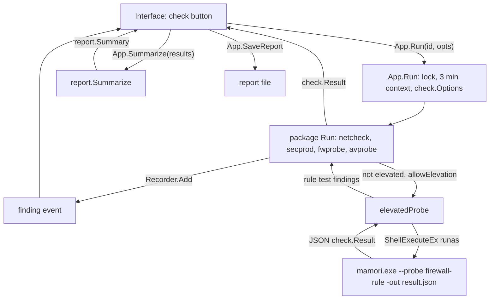
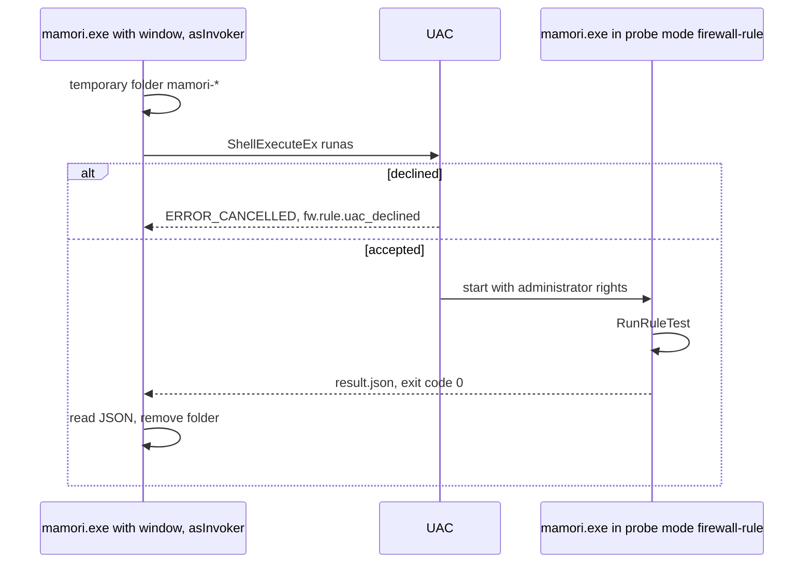

[Русский](../ru/ARCHITECTURE.md) | English

# Architecture

mamori is a Windows desktop application built with Go and Wails v2. The interface (Svelte,
TypeScript) runs in WebView2, the checks are written in Go and call the Windows APIs directly,
without PowerShell or external tools.

Other documents: [CHECKS.md](CHECKS.md) (what is checked and how), [LIMITATIONS.md](LIMITATIONS.md)
(what the checks do not prove).

## Components

| Path | Purpose |
|---|---|
| `main.go` | entry point: `--probe` mode or the Wails window |
| `app.go` | the `App` type bound to the interface: `Info`, `Run`, `Cancel`, `Summarize`, `SaveReport`, `Quit` |
| `checks.go` | table of checks: identifier → the package `Run` function |
| `probe.go` | headless `--probe` mode and the elevated copy of the program |
| `internal/check` | result model (`Status`, `Finding`, `Result`), `Options`, `Recorder` |
| `internal/netcheck` | `internet` check: the internet connection |
| `internal/secprod` | `inventory` check: Security Center (WSC, WMI), Windows Firewall, Defender, product traces |
| `internal/fwprobe` | `firewall` check: firewall state, policy test, rule test |
| `internal/avprobe` | `antivirus` check: the EICAR file and AMSI |
| `internal/elevate` | elevation flag, start of an elevated copy through UAC |
| `internal/report` | summary and overall verdict |
| `internal/sysinfo` | system details: Windows edition, build, architecture, host and user name |
| `internal/version` | version and commit, set at build time |
| `frontend/` | interface; `frontend/wailsjs` holds the generated bindings |
| `build/` | icon, manifest, version resources, NSIS installer script |
| `scripts/e2e.ps1` | end-to-end test of the built `mamori.exe` |

Layout rules:

- every check is a package whose entry point is `Run(ctx, opts, emit) check.Result` (`fwprobe`
  also exports `RunRuleTest` for the elevated copy, `secprod` exports `Products` and `Firewall`
  for `fwprobe`), with no dependency on Wails or the interface;
- Windows code lives in `*_windows.go` files; on other systems `Run` returns `skip` with the
  code `common.unsupported_os`, so `go vet` and unit tests also run on Linux;
- pure logic (parsing Windows answers, classifying errors, verdicts) lives in files without
  build tags and is covered by table tests.

Go dependencies: `golang.org/x/sys/windows`, `github.com/go-ole/go-ole`,
`github.com/yusufpapurcu/wmi`, `github.com/wailsapp/wails/v2`.

## Result model

| Type | JSON fields | Meaning |
|---|---|---|
| `Status` | `pass`, `skip`, `warn`, `fail`, `error` | state of a finding or a check |
| `Finding` | `code`, `status`, `params` | one observation of a check |
| `Result` | `check`, `status`, `code`, `params`, `findings`, `data`, `started`, `elapsedMs` | outcome of one check |

- Statuses are ordered by severity: `pass` < `skip` < `warn` < `fail` < `error` (function
  `check.Worse`).
- `code` is a stable key such as `net.dns.ok`. The interface builds the Russian or English text
  from the code and fills in `params`. Raw values, such as OS error text, travel in `params`
  (usually the key `error`). All `params` values are strings.
- `Result.status` and `Result.code` are the verdict of the check. A pure `verdict` function
  decides it from the set of findings, not the worst status among them: a failed probe with a
  working fallback stays a finding and does not fail the check.
- Only `inventory` fills `data` (the `secprod.Data` struct).
- `Recorder` builds the result: `Start(id, emit)`, `Add`/`AddFinding` (the finding goes to
  `emit` at once), `SetData`, `Finish(status, code)`.
- `Options`: `PolicyTargets` (addresses the firewall policy must block), `EicarWait` (15 s by
  default), `Elevated` (the process already has administrator rights), `Elevate` (function that
  runs a probe in an elevated copy).

## From a button to a result

Methods the interface reaches through the Wails bindings:

| Method | What it does |
|---|---|
| `Info()` | version, commit, elevation flag, system details |
| `Run(id, opts)` | runs one check and returns `check.Result` |
| `Cancel()` | cancels the running check |
| `Summarize(results)` | builds `report.Summary` with the overall verdict |
| `SaveReport(name, content)` | save dialog (`*.txt`, `*.html`, `*.json`), writes the given text; an empty path means cancelled |
| `Quit()` | closes the application |

`Run(id, opts)` step by step:

1. Looks the check up in the `checks` table. An unknown `id` is returned as an error.
2. Takes a lock: one check runs at a time, otherwise the error `another check is running`.
3. Creates a context with a 3 minute timeout, `Cancel()` cancels it.
4. Builds `check.Options` from the interface `RunOptions`:

   | JSON field | Goes to |
   |---|---|
   | `policyTargets` | `PolicyTargets`, empty strings dropped |
   | `eicarWaitSec` | `EicarWait`, when above 0 |
   | `allowElevation` | `Elevate = elevatedProbe`, when the process is not elevated yet |

5. Calls the package `Run`. Every finding is sent at once as the Wails event `finding` with the
   body `{check, finding}`.
6. Returns `check.Result`. The method returns an error only in cases 1 and 2.

Order of the finding stream:

- `internet`: in probe order, as soon as a probe and every probe before it are done;
- `inventory`: as the sources are read;
- `firewall`: state, then the policy results (after every address is tried), then the rule
  test; the findings of an elevated copy arrive together once it exits;
- `antivirus`: EICAR, then AMSI.

On cancellation or timeout every check finishes with status `skip` and code `common.cancelled`.



## Headless mode `--probe`

```
mamori.exe --probe <name> [-out file] [-policy a,b] [-eicar-wait 30s]
```

No window is created. The elevated copy and the end-to-end tests use this mode.

| Name | What runs | JSON output |
|---|---|---|
| `internet`, `inventory`, `firewall`, `antivirus` | one check | `check.Result` |
| `all` | the four checks one after another | `report.Summary` |
| `firewall-rule` | the rule test only (`fwprobe.RunRuleTest`) | `check.Result` with `check: "firewall"` |

| Flag | Value |
|---|---|
| `-out` | file for the JSON (mode `0600`); without it the JSON goes to stdout |
| `-policy` | comma separated addresses the firewall policy must block |
| `-eicar-wait` | how long to wait for the antivirus, a Go duration (`30s`, `1m`) |

| Exit code | When |
|---|---|
| `0` | the result was written, whatever the verdict |
| `2` | no name, bad flags, unknown name |
| `3` | the JSON could not be encoded or written |

- Overall timeout of the mode: 5 minutes.
- `Elevate` is not set in this mode: the `firewall` check runs the rule test only when the
  process itself was started with administrator rights, otherwise `fw.rule.needs_admin`.
- `mamori.exe` is built as a GUI subsystem program: the shell does not wait for it. Use `-out`
  and wait for the process, as `scripts/e2e.ps1` does (`Start-Process -Wait`).

Example (shortened):

```json
{
  "check": "firewall",
  "status": "pass",
  "code": "fw.verdict.works",
  "findings": [
    { "code": "fw.rule.added", "status": "pass", "params": { "name": "mamori-probe-3f9a0c12", "target": "1.1.1.1:443" } },
    { "code": "fw.rule.blocked", "status": "pass", "params": { "error": "...", "ms": "3", "target": "1.1.1.1:443" } },
    { "code": "fw.rule.removed", "status": "pass", "params": { "name": "mamori-probe-3f9a0c12" } },
    { "code": "fw.rule.restored", "status": "pass", "params": { "target": "1.1.1.1:443" } }
  ],
  "started": "2026-10-09T21:30:00.1234567+03:00",
  "elapsedMs": 1240
}
```

## Elevation

- The manifest `build/windows/wails.exe.manifest` sets `requestedExecutionLevel asInvoker`:
  the program starts without a UAC prompt. Administrator rights are needed only by the rule
  test, which adds a firewall rule.
- Where the rule test runs:

  | Condition | Path |
  |---|---|
  | the process is already elevated (`Elevated`) | in the same process |
  | window, `allowElevation`, process not elevated | elevated copy through UAC |
  | otherwise | not run, `fw.rule.needs_admin` (`skip`) |

- The elevated copy (`elevatedProbe` in `probe.go`, `elevate.RunSelf`):
  1. a temporary folder `%TEMP%\mamori-*` is created;
  2. `ShellExecuteExW` with the verb `runas` starts the same exe (`os.Executable`) with the
     arguments `--probe firewall-rule -out <folder>\result.json`; arguments are escaped with
     `windows.EscapeArg`, mask `SEE_MASK_NOCLOSEPROCESS | SEE_MASK_NOASYNC`, window `SW_HIDE`;
  3. the parent waits for the process (`WaitForSingleObject` in 200 ms steps) and reads the exit
     code with `GetExitCodeProcess`; when the context is cancelled the parent stops waiting but
     leaves the copy running, so that its deferred cleanup removes the test rule;
  4. the parent reads `result.json`, decodes the `check.Result` and removes the folder;
  5. the findings of the copy are added to the parent's `firewall` result, the parent decides
     the verdict.
- Errors:

  | Situation | Finding |
  |---|---|
  | the user declined UAC (`ERROR_CANCELLED`, `elevate.ErrCancelled`) | `fw.rule.uac_declined` (`skip`) |
  | non-zero exit code, no file, invalid JSON, any other error | `fw.rule.elevate_error` (`error`) with the text |



## COM and WMI: threads and timeouts

| Where | Apartment | Thread | Timeout |
|---|---|---|---|
| `secprod`: WSC (`IWSCProductList`), `INetFwPolicy2` profiles | STA (`COINIT_APARTMENTTHREADED`) | own goroutine with `runtime.LockOSThread` | 15 s per list read (one product kind, or all firewall profiles) |
| `secprod`: WMI `root\SecurityCenter2`, Defender | MTA, initialized by the `wmi` library | the library locks the thread itself and runs queries one at a time | 15 s per query |
| `fwprobe`: rule test (`HNetCfg.FwPolicy2`, `HNetCfg.FWRule`) | STA | the whole test on one locked goroutine | none for COM calls, connections have their own |

- `CoInitializeEx` returns `S_FALSE`: COM is already initialized on the thread, the program
  calls `CoUninitialize` at the end. `RPC_E_CHANGED_MODE`: the thread is already in another
  apartment, work goes on without uninitializing.
- `WSCProductList` is registered with `ThreadingModel Apartment`, so the object is created and
  called on the same thread. go-ole has no binding for `IWSCProductList`, its methods are called
  through the virtual function table as declared in `iwscapi.h` (SDK 10.0.26100.0). BSTR strings
  are freed with `SysFreeString`.
- The `await` function runs a call on its own goroutine and stops waiting at the timeout. A hung
  call still holds its goroutine, and under `withCOM` its locked OS thread.
- `IcmpSendEcho2` is synchronous and bounded by its own timeout; on cancellation `internet` does
  not wait for it.

Other timeouts:

| Where | Value |
|---|---|
| `App.Run`, one check | 3 min |
| `--probe`, the whole run | 5 min |
| `internet`, each probe (probes run in parallel) | 3 s |
| `firewall`, policy address | 5 s |
| `firewall`, control and checking connection | 4 s |
| `firewall`, pause after adding and removing the rule | 300 ms |
| `antivirus`, wait for the reaction to EICAR | 15 s by default, polled every 250 ms |

## Build and release

The version lives in `internal/version` (`Version`, `dev` by default, and `Commit`) and is set
with `-ldflags "-X ..."`:

| Build | `Version` | `Commit` |
|---|---|---|
| `make build`, `make installer` | `git describe --tags --always --dirty` | `git rev-parse --short HEAD` |
| CI (`ci.yml`) | `ci-<7 characters of the SHA>` | 7 characters of the SHA |
| release (`release.yml`) | tag without `v` | 7 characters of the SHA |

On release the tag version is also written to `wails.json` (`info.productVersion`). Wails
builds the file version resource (`build/windows/info.json`), the assembly version in the
manifest and the installer version from it.

`Makefile` targets:

| Target | What it does |
|---|---|
| `make check` | gofmt, `go vet` for windows and linux, `go test -short`, frontend checks |
| `make test` | `go test -race -count=1 ./...`, live tests included |
| `make lint` | golangci-lint |
| `make build` | `wails build -clean -trimpath -ldflags ...` |
| `make installer` | the same plus `-webview2 embed -nsis` |
| `make dev` | `wails dev` |
| `make bindings` | `wails generate module`, refreshes `frontend/wailsjs` |

`wails build` flags:

| Flag | Meaning |
|---|---|
| `-clean` | clean `build/bin` before the build |
| `-trimpath` | strip file system paths from the binary |
| `-ldflags` | version and commit |
| `-m` | skip `go mod tidy` (CI) |
| `-nosyncgomod` | do not change the Wails version in `go.mod` (CI) |
| `-webview2 embed` | embed the WebView2 Runtime bootstrapper |
| `-nsis` | build the NSIS installer |
| `-platform windows/amd64,windows/arm64` | two architectures (release) |

Installer (`build/windows/installer/project.nsi`): installs to `Program Files\mamori` by default
and needs administrator rights, installs the WebView2 Runtime when it is missing, creates Start
menu and desktop shortcuts, registers an uninstaller, languages English and Russian. File:
`build/bin/mamori-<arch>-installer.exe`.

### CI (`.github/workflows/ci.yml`)

Runs on every pull request and every push to `main`. Actions are pinned by SHA, default
permissions are `contents: read`.

| Job | Runner | What it does | What it proves |
|---|---|---|---|
| `lint` | ubuntu | gofmt, `go vet` for windows over the whole module and for linux over `internal/...`, golangci-lint for windows | the code is formatted, vet and the linter are clean, the stubs for other systems build |
| `test` | ubuntu, windows | `go test -race -short -count=1 ./...` | the pure logic is right on both systems: parsing, error classification, verdicts, the rule test sequence against a fake firewall |
| `vulncheck` | ubuntu | govulncheck v1.8.0 for windows | no known vulnerabilities in reachable code of the dependencies and the standard library |
| `frontend` | ubuntu | `npm ci`, lint, check, test, build | the interface passes the linter, the type check and the tests, and builds |
| `build` | windows | Wails v2.16.0, NSIS, `wails build ... -webview2 embed -nsis`, artifact kept 7 days | the application and the installer build; `frontend/wailsjs` matches the Go methods |
| `e2e` | windows | `scripts/e2e.ps1` on the built `mamori.exe` | the exe runs headless on a real Windows, the test rule is cleaned up |

`-short` skips the live tests: runners have Defender switched off and no Security Center.

The end-to-end test `scripts/e2e.ps1` on the runner (the runner process is elevated, so the rule
test runs for real):

1. `--probe all -out ...`: the summary has a result for each of the four checks and no code
   `common.not_implemented`.
2. `--probe firewall-rule -out ...`.
3. `Get-NetFirewallRule -DisplayName 'mamori-probe-*'` is empty: no rules left behind.
4. If `firewall` found `fw.state.enforcing`, the rule test must contain `fw.rule.blocked`.
5. A table of statuses and verdicts goes to the job summary. The `antivirus` check is expected to
   fail on the runner.

### Release (`.github/workflows/release.yml`)

Runs on a `vX.Y.Z` tag:

1. the tag version is written to `wails.json`;
2. build for `windows/amd64` and `windows/arm64` with NSIS installers, check that both
   installers exist;
3. `SHA256SUMS.txt` over every `.exe` in `build/bin`;
4. build provenance attestation (`actions/attest-build-provenance`) for the `.exe` files;
5. a draft release (`gh release create --draft --verify-tag --generate-notes`) with the `.exe`
   files and the sums; the release title and text are edited by hand before publishing.
