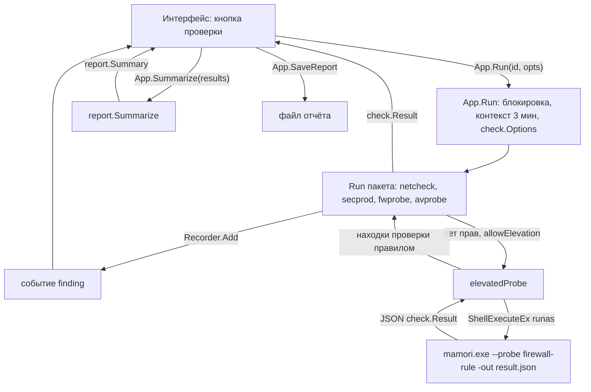
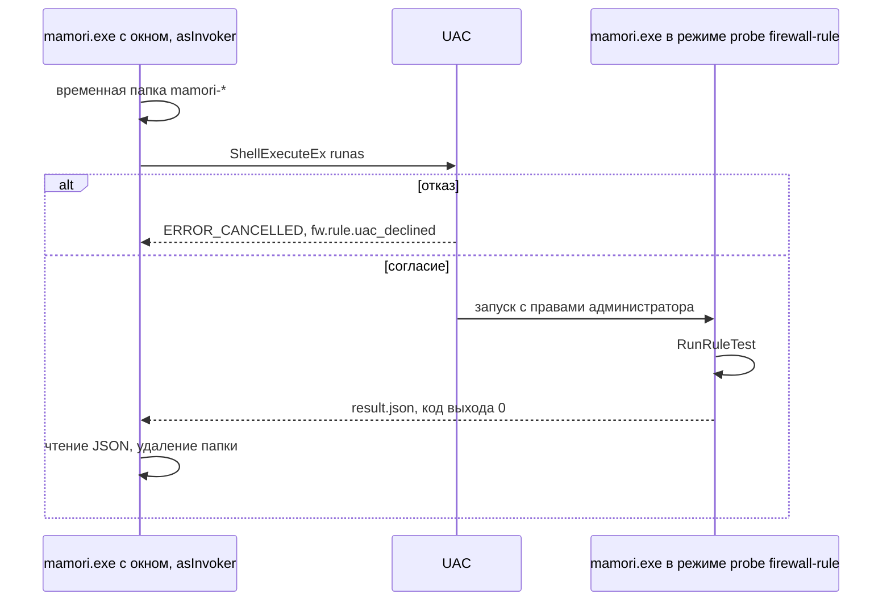

Русский | [English](../en/ARCHITECTURE.md)

# Архитектура

mamori: настольное приложение для Windows на Go и Wails v2. Интерфейс (Svelte, TypeScript)
работает в WebView2, проверки написаны на Go и обращаются к API Windows напрямую, без PowerShell
и внешних утилит.

Другие документы: [CHECKS.md](CHECKS.md) (что и как проверяется), [LIMITATIONS.md](LIMITATIONS.md)
(чего проверки не доказывают).

## Компоненты

| Путь | Назначение |
|---|---|
| `main.go` | точка входа: режим `--probe` или окно Wails |
| `app.go` | тип `App`, привязанный к интерфейсу: `Info`, `Run`, `Cancel`, `Summarize`, `SaveReport`, `Quit` |
| `checks.go` | таблица проверок: идентификатор → функция `Run` пакета |
| `probe.go` | безоконный режим `--probe` и запуск копии с правами администратора |
| `internal/check` | модель результата (`Status`, `Finding`, `Result`), `Options`, `Recorder` |
| `internal/netcheck` | проверка `internet`: подключение к интернету |
| `internal/secprod` | проверка `inventory`: Центр безопасности (WSC, WMI), брандмауэр Windows, Defender, следы продуктов |
| `internal/fwprobe` | проверка `firewall`: состояние МЭ, проверка политики, проверка правилом |
| `internal/avprobe` | проверка `antivirus`: файл EICAR и AMSI |
| `internal/elevate` | признак повышенных прав, запуск копии программы через UAC |
| `internal/report` | сводка и итоговый вердикт |
| `internal/sysinfo` | сведения о системе: выпуск Windows, сборка, архитектура, имя ПК и пользователя |
| `internal/version` | версия и коммит, задаются при сборке |
| `frontend/` | интерфейс; `frontend/wailsjs` содержит сгенерированные привязки |
| `build/` | иконка, манифест, ресурсы версии, сценарий установщика NSIS |
| `scripts/e2e.ps1` | сквозная проверка собранного `mamori.exe` |

Правила раскладки:

- каждая проверка это пакет со входом `Run(ctx, opts, emit) check.Result` (`fwprobe` также
  экспортирует `RunRuleTest` для повышенной копии, `secprod` экспортирует `Products` и `Firewall`
  для `fwprobe`), без зависимости от Wails и интерфейса;
- код для Windows лежит в файлах `*_windows.go`, на других ОС `Run` возвращает `skip` с кодом
  `common.unsupported_os`, поэтому `go vet` и модульные тесты идут и на Linux;
- чистая логика (разбор ответов Windows, классификация ошибок, вердикты) лежит в файлах без
  тегов сборки и покрыта табличными тестами.

Зависимости Go: `golang.org/x/sys/windows`, `github.com/go-ole/go-ole`,
`github.com/yusufpapurcu/wmi`, `github.com/wailsapp/wails/v2`.

## Модель результата

| Тип | Поля JSON | Смысл |
|---|---|---|
| `Status` | `pass`, `skip`, `warn`, `fail`, `error` | состояние находки или проверки |
| `Finding` | `code`, `status`, `params` | одно наблюдение проверки |
| `Result` | `check`, `status`, `code`, `params`, `findings`, `data`, `started`, `elapsedMs` | итог одной проверки |

- Статусы упорядочены по тяжести: `pass` < `skip` < `warn` < `fail` < `error` (функция
  `check.Worse`).
- `code` это стабильный ключ вида `net.dns.ok`. Текст на русском или английском по коду строит
  интерфейс, подставляя `params`. Сырые значения, например текст ошибки ОС, передаются в
  `params` (обычно ключ `error`). Все значения `params` строковые.
- `Result.status` и `Result.code` это вердикт проверки. Его решает чистая функция `verdict` по
  набору находок, а не самый тяжёлый статус среди них: неудачная проба при сработавшем запасном
  способе остаётся находкой и не валит проверку.
- `data` заполняет только `inventory` (структура `secprod.Data`).
- `Recorder` собирает результат: `Start(id, emit)`, `Add`/`AddFinding` (находка сразу уходит в
  `emit`), `SetData`, `Finish(status, code)`.
- `Options`: `PolicyTargets` (адреса, которые политика МЭ должна блокировать), `EicarWait`
  (по умолчанию 15 с), `Elevated` (процесс уже с правами администратора), `Elevate` (функция
  запуска пробы в повышенной копии).

## От кнопки до результата

Методы, доступные интерфейсу через привязки Wails:

| Метод | Что делает |
|---|---|
| `Info()` | версия, коммит, признак повышенных прав, сведения о системе |
| `Run(id, opts)` | выполняет одну проверку и возвращает `check.Result` |
| `Cancel()` | отменяет текущую проверку |
| `Summarize(results)` | строит `report.Summary` с итоговым вердиктом |
| `SaveReport(name, content)` | диалог сохранения (`*.txt`, `*.html`, `*.json`), записывает переданный текст; пустой путь означает отмену |
| `Quit()` | закрывает приложение |

`Run(id, opts)` по шагам:

1. Ищет проверку в таблице `checks`. Неизвестный `id` возвращается ошибкой.
2. Берёт блокировку: одновременно идёт только одна проверка, иначе ошибка
   `another check is running`.
3. Создаёт контекст с тайм-аутом 3 минуты, `Cancel()` отменяет его.
4. Собирает `check.Options` из `RunOptions` интерфейса:

   | Поле JSON | Куда попадает |
   |---|---|
   | `policyTargets` | `PolicyTargets`, пустые строки отбрасываются |
   | `eicarWaitSec` | `EicarWait`, если больше 0 |
   | `allowElevation` | `Elevate = elevatedProbe`, если процесс ещё не повышен |

5. Вызывает `Run` пакета. Каждая находка сразу отправляется событием Wails `finding` с телом
   `{check, finding}`.
6. Возвращает `check.Result`. Ошибкой метод отвечает только в случаях 1 и 2.

Порядок потока находок:

- `internet`: в порядке проб, как только завершены проба и все пробы перед ней;
- `inventory`: по мере чтения источников;
- `firewall`: состояние, затем результаты политики (после опроса всех адресов), затем проверка
  правилом; находки повышенной копии приходят разом после её завершения;
- `antivirus`: EICAR, затем AMSI.

При отмене или тайм-ауте каждая проверка завершается со статусом `skip` и кодом
`common.cancelled`.



## Безоконный режим `--probe`

```
mamori.exe --probe <имя> [-out файл] [-policy a,b] [-eicar-wait 30s]
```

Окно не создаётся. Режим используют повышенная копия и сквозные тесты.

| Имя | Что выполняется | JSON на выходе |
|---|---|---|
| `internet`, `inventory`, `firewall`, `antivirus` | одна проверка | `check.Result` |
| `all` | четыре проверки по очереди | `report.Summary` |
| `firewall-rule` | только проверка правилом (`fwprobe.RunRuleTest`) | `check.Result` с `check: "firewall"` |

| Флаг | Значение |
|---|---|
| `-out` | путь файла для JSON (права `0600`); без флага JSON идёт в stdout |
| `-policy` | адреса через запятую, которые политика МЭ должна блокировать |
| `-eicar-wait` | ожидание реакции антивируса, длительность Go (`30s`, `1m`) |

| Код выхода | Когда |
|---|---|
| `0` | результат записан, каким бы ни был вердикт |
| `2` | нет имени, ошибка флагов, неизвестное имя |
| `3` | не удалось сериализовать или записать JSON |

- Общий тайм-аут режима: 5 минут.
- `Elevate` в этом режиме не задан: проверка `firewall` выполняет проверку правилом, только
  если процесс сам запущен с правами администратора, иначе находка `fw.rule.needs_admin`.
- `mamori.exe` собран как программа с графической подсистемой: оболочка не ждёт её завершения.
  Нужен флаг `-out` и ожидание процесса, как в `scripts/e2e.ps1` (`Start-Process -Wait`).

Пример (сокращён):

```json
{
  "check": "firewall",
  "status": "pass",
  "code": "fw.verdict.works",
  "findings": [
    { "code": "fw.rule.added", "status": "pass", "params": { "name": "mamori-probe-3f9a0c12", "target": "1.1.1.1:443" } },
    { "code": "fw.rule.blocked", "status": "pass", "params": { "error": "...", "ms": "3", "target": "1.1.1.1:443" } },
    { "code": "fw.rule.removed", "status": "pass", "params": { "name": "mamori-probe-3f9a0c12" } },
    { "code": "fw.rule.restored", "status": "pass", "params": { "target": "1.1.1.1:443" } }
  ],
  "started": "2026-10-09T21:30:00.1234567+03:00",
  "elapsedMs": 1240
}
```

## Повышение прав

- Манифест `build/windows/wails.exe.manifest` задаёт `requestedExecutionLevel asInvoker`:
  программа стартует без запроса UAC. Права администратора нужны только проверке правилом,
  которая добавляет правило брандмауэра.
- Где выполняется проверка правилом:

  | Условие | Путь |
  |---|---|
  | процесс уже повышен (`Elevated`) | в этом же процессе |
  | окно, `allowElevation`, процесс не повышен | повышенная копия через UAC |
  | иначе | не выполняется, `fw.rule.needs_admin` (`skip`) |

- Повышенная копия (`elevatedProbe` в `probe.go`, `elevate.RunSelf`):
  1. создаётся временная папка `%TEMP%\mamori-*`;
  2. `ShellExecuteExW` с глаголом `runas` запускает тот же exe (`os.Executable`) с аргументами
     `--probe firewall-rule -out <папка>\result.json`; аргументы экранируются
     `windows.EscapeArg`, маска `SEE_MASK_NOCLOSEPROCESS | SEE_MASK_NOASYNC`, окно `SW_HIDE`;
  3. родитель ждёт процесс (`WaitForSingleObject` с шагом 200 мс) и читает код выхода
     `GetExitCodeProcess`; при отмене контекста родитель перестаёт ждать, но копию не
     завершает, чтобы её отложенная очистка удалила тестовое правило;
  4. родитель читает `result.json`, разбирает `check.Result` и удаляет папку;
  5. находки копии добавляются в результат `firewall` родителя, вердикт решает родитель.
- Ошибки:

  | Ситуация | Находка |
  |---|---|
  | пользователь отказал в UAC (`ERROR_CANCELLED`, `elevate.ErrCancelled`) | `fw.rule.uac_declined` (`skip`) |
  | ненулевой код выхода, нет файла, неверный JSON, иная ошибка | `fw.rule.elevate_error` (`error`) с текстом |



## COM и WMI: потоки и тайм-ауты

| Где | Апартамент | Поток | Тайм-аут |
|---|---|---|---|
| `secprod`: WSC (`IWSCProductList`), профили `INetFwPolicy2` | STA (`COINIT_APARTMENTTHREADED`) | своя горутина с `runtime.LockOSThread` | 15 с на чтение списка (один вид продуктов или все профили) |
| `secprod`: WMI `root\SecurityCenter2`, Defender | MTA, инициализирует библиотека `wmi` | библиотека сама закрепляет поток и выполняет запросы по одному | 15 с на запрос |
| `fwprobe`: проверка правилом (`HNetCfg.FwPolicy2`, `HNetCfg.FWRule`) | STA | вся проверка на одной закреплённой горутине | у вызовов COM нет, у соединений свои |

- `CoInitializeEx` возвращает `S_FALSE`: COM уже инициализирован на потоке, программа вызывает
  `CoUninitialize` в конце. `RPC_E_CHANGED_MODE`: поток уже в другом апартаменте, работа идёт
  без деинициализации.
- `WSCProductList` зарегистрирован с `ThreadingModel Apartment`, поэтому объект создаётся и
  вызывается на одном и том же потоке. go-ole не имеет привязки к `IWSCProductList`, методы
  вызываются через таблицу виртуальных функций по `iwscapi.h` (SDK 10.0.26100.0). Строки BSTR
  освобождаются `SysFreeString`.
- Функция `await` запускает вызов в своей горутине и перестаёт ждать по тайм-ауту. Зависший
  вызов при этом продолжает занимать горутину, а под `withCOM` и закреплённый поток ОС.
- `IcmpSendEcho2` синхронный и ограничен собственным тайм-аутом; при отмене `internet` не ждёт его.

Остальные тайм-ауты:

| Где | Значение |
|---|---|
| `App.Run`, одна проверка | 3 мин |
| `--probe`, весь запуск | 5 мин |
| `internet`, каждая проба (пробы идут параллельно) | 3 с |
| `firewall`, адрес политики | 5 с |
| `firewall`, контрольное и проверочное соединение | 4 с |
| `firewall`, пауза после добавления и удаления правила | 300 мс |
| `antivirus`, ожидание реакции на EICAR | 15 с по умолчанию, опрос каждые 250 мс |

## Сборка и выпуск

Версия хранится в `internal/version` (`Version`, по умолчанию `dev`, и `Commit`) и задаётся
флагом `-ldflags "-X ..."`:

| Сборка | `Version` | `Commit` |
|---|---|---|
| `make build`, `make installer` | `git describe --tags --always --dirty` | `git rev-parse --short HEAD` |
| CI (`ci.yml`) | `ci-<7 символов SHA>` | 7 символов SHA |
| выпуск (`release.yml`) | тег без `v` | 7 символов SHA |

При выпуске версия тега записывается и в `wails.json` (`info.productVersion`). Из неё Wails
строит ресурс версии файла (`build/windows/info.json`), версию сборки в манифесте и версию
установщика.

Команды `Makefile`:

| Команда | Что делает |
|---|---|
| `make check` | gofmt, `go vet` под windows и linux, `go test -short`, проверки фронтенда |
| `make test` | `go test -race -count=1 ./...`, включая живые тесты |
| `make lint` | golangci-lint |
| `make build` | `wails build -clean -trimpath -ldflags ...` |
| `make installer` | то же плюс `-webview2 embed -nsis` |
| `make dev` | `wails dev` |
| `make bindings` | `wails generate module`, обновляет `frontend/wailsjs` |

Флаги `wails build`:

| Флаг | Смысл |
|---|---|
| `-clean` | очистить `build/bin` перед сборкой |
| `-trimpath` | убрать пути файловой системы из бинарника |
| `-ldflags` | версия и коммит |
| `-m` | не выполнять `go mod tidy` (CI) |
| `-nosyncgomod` | не менять версию Wails в `go.mod` (CI) |
| `-webview2 embed` | встроить загрузчик WebView2 Runtime |
| `-nsis` | собрать установщик NSIS |
| `-platform windows/amd64,windows/arm64` | две архитектуры (выпуск) |

Установщик (`build/windows/installer/project.nsi`): по умолчанию ставит в
`Program Files\mamori` и требует прав администратора, при отсутствии WebView2 Runtime
устанавливает его, создаёт ярлыки в меню Пуск и на рабочем столе, регистрирует деинсталлятор,
языки английский и русский. Файл: `build/bin/mamori-<arch>-installer.exe`.

### CI (`.github/workflows/ci.yml`)

Запуск на каждый pull request и push в `main`. Экшены закреплены по SHA, права по умолчанию
`contents: read`.

| Задание | Раннер | Что делает | Что доказывает |
|---|---|---|---|
| `lint` | ubuntu | gofmt, `go vet` под windows для всего модуля и под linux для `internal/...`, golangci-lint под windows | код отформатирован, нет ошибок vet и линтера, заглушки для других ОС собираются |
| `test` | ubuntu, windows | `go test -race -short -count=1 ./...` | чистая логика верна на обеих ОС: разбор ответов, классификация ошибок, вердикты, последовательность проверки правилом на поддельном брандмауэре |
| `vulncheck` | ubuntu | govulncheck v1.8.0 под windows | нет известных уязвимостей в достижимом коде зависимостей и стандартной библиотеки |
| `frontend` | ubuntu | `npm ci`, lint, check, test, build | интерфейс проходит линтер, проверку типов, тесты и собирается |
| `build` | windows | Wails v2.16.0, NSIS, `wails build ... -webview2 embed -nsis`, артефакт на 7 дней | приложение и установщик собираются; `frontend/wailsjs` совпадает с методами Go |
| `e2e` | windows | `scripts/e2e.ps1` на собранном `mamori.exe` | exe работает без окна на настоящей Windows, правило проверки убирается за собой |

Ключ `-short` пропускает живые тесты: на раннерах выключен Defender и нет Центра безопасности.

Сквозная проверка `scripts/e2e.ps1` на раннере (процесс раннера повышен, поэтому проверка
правилом выполняется по-настоящему):

1. `--probe all -out ...`: в сводке есть результат каждой из четырёх проверок, нет кода
   `common.not_implemented`.
2. `--probe firewall-rule -out ...`.
3. `Get-NetFirewallRule -DisplayName 'mamori-probe-*'` пуст: правил не осталось.
4. Если `firewall` нашёл `fw.state.enforcing`, проверка правилом обязана содержать
   `fw.rule.blocked`.
5. Таблица статусов и вердиктов уходит в сводку задания. Проверка `antivirus` на раннере
   ожидаемо не проходит.

### Выпуск (`.github/workflows/release.yml`)

Запуск по тегу `vX.Y.Z`:

1. версия тега записывается в `wails.json`;
2. сборка для `windows/amd64` и `windows/arm64` с установщиками NSIS, проверка, что оба
   установщика есть;
3. `SHA256SUMS.txt` по всем `.exe` из `build/bin`;
4. аттестация происхождения сборки (`actions/attest-build-provenance`) для `.exe`;
5. черновик релиза (`gh release create --draft --verify-tag --generate-notes`) с `.exe` и
   суммами; заголовок и текст релиза правятся вручную перед публикацией.
